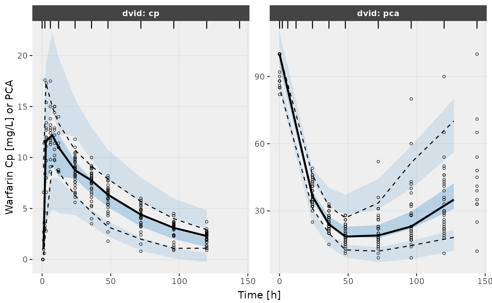
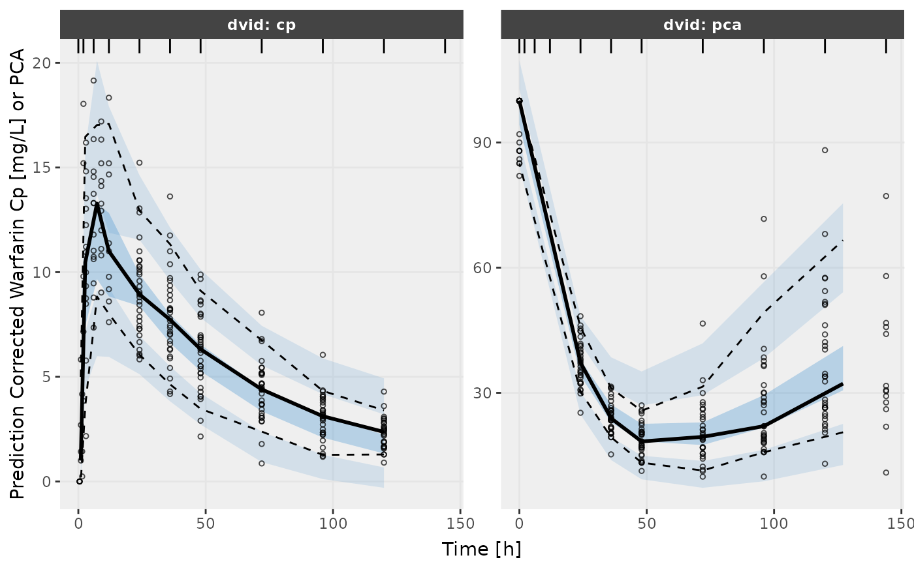

# Running NONMEM with nlmixr2

``` r

library(babelmixr2)
```

## Step 0: What do you need to do to have `nlmixr2` run `NONMEM` from a nlmixr2 model

To use `NONMEM` in nlmixr, you do not need to change your data or your
`nlmixr2` dataset. `babelmixr2` will do the heavy lifting here.

You do need to setup how to run `NONMEM`. For many cases this is easy;
You simply have to figure out the command to run `NONMEM` (it is often
useful to use the full command path). You can set it in
`options("babelmixr2.nonmem"="nmfe743")` or use
`nonmemControl(runCommand="nmfe743")`. I prefer the
[`options()`](https://rdrr.io/r/base/options.html) method since you only
need to set it once. This could also be a function if you prefer (but I
will not cover using the function here).

## Step 1: Run a `nlmixr2` in NONMEM

Lets take the classic warfarin example to start the comparison.

The model we use in the `nlmixr2` vignettes is:

``` r

library(babelmixr2)
pk.turnover.emax3 <- function() {
  ini({
    tktr <- log(1)
    tka <- log(1)
    tcl <- log(0.1)
    tv <- log(10)
    ##
    eta.ktr ~ 1
    eta.ka ~ 1
    eta.cl ~ 2
    eta.v ~ 1
    prop.err <- 0.1
    pkadd.err <- 0.1
    ##
    temax <- logit(0.8)
    tec50 <- log(0.5)
    tkout <- log(0.05)
    te0 <- log(100)
    ##
    eta.emax ~ .5
    eta.ec50  ~ .5
    eta.kout ~ .5
    eta.e0 ~ .5
    ##
    pdadd.err <- 10
  })
  model({
    ktr <- exp(tktr + eta.ktr)
    ka <- exp(tka + eta.ka)
    cl <- exp(tcl + eta.cl)
    v <- exp(tv + eta.v)
    emax = expit(temax+eta.emax)
    ec50 =  exp(tec50 + eta.ec50)
    kout = exp(tkout + eta.kout)
    e0 = exp(te0 + eta.e0)
    ##
    DCP = center/v
    PD=1-emax*DCP/(ec50+DCP)
    ##
    effect(0) = e0
    kin = e0*kout
    ##
    d/dt(depot) = -ktr * depot
    d/dt(gut) =  ktr * depot -ka * gut
    d/dt(center) =  ka * gut - cl / v * center
    d/dt(effect) = kin*PD -kout*effect
    ##
    cp = center / v
    cp ~ prop(prop.err) + add(pkadd.err)
    effect ~ add(pdadd.err) | pca
  })
}
```

Now you can run the `nlmixr2` model using `NONMEM` you simply can run it
directly:

``` r

try(nlmixr(pk.turnover.emax3, nlmixr2data::warfarin, "nonmem",
           nonmemControl(readRounding=FALSE, modelName="pk.turnover.emax3")),
    silent=TRUE)
#> ℹ parameter labels from comments are typically ignored in non-interactive mode
#> ℹ Need to run with the source intact to parse comments
#> → loading into symengine environment...
#> → pruning branches (`if`/`else`) of full model...
#> ✔ done
#> 
#> 
#>  WARNINGS AND ERRORS (IF ANY) FOR PROBLEM    1
#> 
#>  (WARNING  2) NM-TRAN INFERS THAT THE DATA ARE POPULATION.
#> 
#> 
#> 0MINIMIZATION TERMINATED
#>  DUE TO ROUNDING ERRORS (ERROR=134)
#>  NO. OF FUNCTION EVALUATIONS USED:     1088
#>  NO. OF SIG. DIGITS UNREPORTABLE
#> 0PARAMETER ESTIMATE IS NEAR ITS BOUNDARY
#> 
#> nonmem model: 'pk.turnover.emax3-nonmem/pk.turnover.emax3.nmctl'
#> → terminated with rounding errors, can force nlmixr2/rxode2 to read with nonmemControl(readRounding=TRUE)
```

That this is the same way you would run an ordinary `nlmixr2` model, but
it is simply a new estimation method `"nonmem"` with a new controller
([`nonmemControl()`](https://nlmixr2.github.io/babelmixr2/reference/nonmemControl.md))
to setup options for estimation.

A few options in the
[`nonmemControl()`](https://nlmixr2.github.io/babelmixr2/reference/nonmemControl.md)
here is `modelName` which helps control the output directory of `NONMEM`
(if not specified `babelmixr2` tries to guess based on the model name
based on the input).

If you try this yourself, you see that `NONMEM` fails with rounding
errors. You could do the standard approach of changing `sigdig`, `sigl`,
`tol` etc, to get a successful `NONMEM` model convergence, of course
that is supported. But with `babelmixr2` you can *do more*.

## Optional Step 2: Recover a failed NONMEM run

One of the other approaches is to **ignore** the rounding errors that
have occurred and read into `nlmixr2` anyway:

``` r

# Can still load the model to get information (possibly pipe) and create a new model
f <- nlmixr(pk.turnover.emax3, nlmixr2data::warfarin, "nonmem",
            nonmemControl(readRounding=TRUE, modelName="pk.turnover.emax3"))
#> ℹ parameter labels from comments are typically ignored in non-interactive mode
#> ℹ Need to run with the source intact to parse comments
#> → loading into symengine environment...
#> → pruning branches (`if`/`else`) of full model...
#> ✔ done
#> → loading into symengine environment...
#> → pruning branches (`if`/`else`) of full model...
#> ✔ done
#> → optimizing duplicate expressions in EBE model (2 chunks)...
#> [====|====|====|====|====|====|====|====|====|====] 0:00:00 
#> 
#> [====|====|====|====|====|====|====|====|====|====] 0:00:00 
#> 
#> [====|====|====|====|====|====|====|====|====|====] 0:00:00 
#> 
#> [====|====|====|====|====|====|====|====|====|====] 0:00:00
#> → compiling EBE model...
#> ✔ done
#> rxode2 5.1.4 using 2 threads (see ?getRxThreads)
#>   no cache: create with `rxCreateCache()`
#> → Calculating residuals/tables
#> ✔ done
#> → compress origData in nlmixr2 object, save 27800
#> → compress parHistData in nlmixr2 object, save 4864
```

You may see more work happening than you expected to need for an already
completed model. When reading in a NONMEM model, `babelmixr2` grabs:

- `NONMEM`’s objective function value
- `NONMEM`’s covariance (if available)
- `NONMEM`’s optimization history
- `NONMEM`’s final parameter estimates (including the ETAs)
- `NONMEM`’s `PRED` and `IPRED` values (for validation purposes)

These are used to solve the ODEs *as if they came from an nlmixr2*
optimization procedure.

This means that you can compare the `IPRED` and `PRED` values of
`nlmixr2`/`rxode2` and *know immediately* if your model validates.

This is similar to the procedure Kyle Baron advocates for validating a
NONMEM model against a `mrgsolve` model (see
<https://mrgsolve.org/blog/posts/2022-05-validate-translation/> and
<https://mrgsolve.org/blog/posts/2023-update-validation.html>),

The advantage of this method is that you need to simply write one model
to get a validated `roxde2`/`nlmixr2` model.

In this case you can see the validation when you print the fit object:

``` r

print(f)
#> ── nlmixr² nonmem ver 7.4.3 ──
#> 
#>                 OBJF      AIC      BIC Log-likelihood Condition#(Cov)
#> nonmem focei 1326.91 2252.605 2332.025      -1107.302              NA
#>              Condition#(Cor)
#> nonmem focei              NA
#> 
#> ── Time (sec $time): ──
#> 
#>             setup preprocess postprocess table compress NONMEM
#> elapsed 0.8481431      0.027       0.027 0.098    0.017 320.27
#> 
#> ── Population Parameters ($parFixed or $parFixedDf): ──
#> 
#>                Est. SE %RSE Back-transformed(95%CI) BSV(CV% or SD) Shrink(SD)%
#> tktr       6.241e-7                           1.000          86.45      59.84 
#> tka       -3.006e-6                           1.000          86.48      59.84 
#> tcl          -2.004                          0.1348          28.59      1.341 
#> tv            2.052                           7.783          22.83      6.442 
#> prop.err    0.09858                         0.09858                           
#> pkadd.err    0.5116                          0.5116                           
#> temax         6.418                          0.9984       0.007071      99.99 
#> tec50        0.1408                           1.151          44.98      6.065 
#> tkout        -2.953                         0.05216          9.164      32.42 
#> te0           4.570                           96.59          5.243      18.09 
#> pdadd.err     3.717                           3.717                           
#>  
#>   No correlations in between subject variability (BSV) matrix
#>   Full BSV covariance ($omega) or correlation ($omegaR; diagonals=SDs) 
#>   Distribution stats (mean/skewness/kurtosis/p-value) available in $shrink 
#>   Information about run found ($runInfo):
#>    • NONMEM terminated due to rounding errors, but reading into nlmixr2/rxode2 anyway 
#>   Censoring ($censInformation): No censoring
#>   Minimization message ($message):  
#>     
#> 
#>  WARNINGS AND ERRORS (IF ANY) FOR PROBLEM    1
#> 
#>  (WARNING  2) NM-TRAN INFERS THAT THE DATA ARE POPULATION.
#> 
#>     
#> 0MINIMIZATION TERMINATED
#>  DUE TO ROUNDING ERRORS (ERROR=134)
#>  NO. OF FUNCTION EVALUATIONS USED:     1088
#>  NO. OF SIG. DIGITS UNREPORTABLE
#> 0PARAMETER ESTIMATE IS NEAR ITS BOUNDARY
#> 
#>     IPRED relative difference compared to Nonmem IPRED: 0%; 95% percentile: (0%,0%); rtol=6.36e-06
#>     PRED relative difference compared to Nonmem PRED: 0%; 95% percentile: (0%,0%); rtol=6.08e-06
#>     IPRED absolute difference compared to Nonmem IPRED: 95% percentile: (2.53e-06, 0.000502); atol=7.15e-05
#>     PRED absolute difference compared to Nonmem PRED: 95% percentile: (3.79e-07,0.00321); atol=6.08e-06
#>     there are solving errors during optimization (see '$prderr')
#>     nonmem model: 'pk.turnover.emax3-nonmem/pk.turnover.emax3.nmctl' 
#> 
#> ── Fit Data (object is a modified tibble): ──
#> # A tibble: 483 × 35
#>   ID     TIME CMT      DV  PRED   RES IPRED   IRES  IWRES eta.ktr eta.ka eta.cl
#>   <fct> <dbl> <fct> <dbl> <dbl> <dbl> <dbl>  <dbl>  <dbl>   <dbl>  <dbl>  <dbl>
#> 1 1       0.5 cp      0    1.16 -1.16 0.444 -0.444 -0.864  -0.506 -0.506  0.699
#> 2 1       1   cp      1.9  3.37 -1.47 1.45   0.446  0.840  -0.506 -0.506  0.699
#> 3 1       2   cp      3.3  7.51 -4.21 3.96  -0.660 -1.03   -0.506 -0.506  0.699
#> # ℹ 480 more rows
#> # ℹ 23 more variables: eta.v <dbl>, eta.emax <dbl>, eta.ec50 <dbl>,
#> #   eta.kout <dbl>, eta.e0 <dbl>, cp <dbl>, depot <dbl>, gut <dbl>,
#> #   center <dbl>, effect <dbl>, ktr <dbl>, ka <dbl>, cl <dbl>, v <dbl>,
#> #   emax <dbl>, ec50 <dbl>, kout <dbl>, e0 <dbl>, DCP <dbl>, PD <dbl>,
#> #   kin <dbl>, tad <dbl>, dosenum <dbl>
```

Which shows the `preds` and `ipreds` match between `NONMEM` and
`nlmixr2` quite well.

## Optional Step 3: Use `nlmixr2` to help understand why `NONMEM` failed

Since it *is* a `nlmixr2` fit, you can do interesting things with this
fit that you couldn’t do in `NONMEM` or even in another translator. For
example, if you wanted to add a covariance step you can with
[`getVarCov()`](https://rdrr.io/pkg/nlme/man/getVarCov.html):

``` r

getVarCov(f)
#> → loading into symengine environment...
#> → pruning branches (`if`/`else`) of full model...
#> ✔ done
#> [====|====|====|====|====|====|====|====|====|====] 0:00:00
#> → calculate sensitivities
#> [====|====|====|====|====|====|====|====|====|====] 0:00:00
#> → calculate ∂(f)/∂(η)
#> [====|====|====|====|====|====|====|====|====|====] 0:00:00
#> → optimizing duplicate expressions in inner model (2 chunks)...
#> [====|====|====|====|====|====|====|====|====|====] 0:00:00 
#> 
#> [====|====|====|====|====|====|====|====|====|====] 0:00:00 
#> 
#> [====|====|====|====|====|====|====|====|====|====] 0:00:00 
#> 
#> [====|====|====|====|====|====|====|====|====|====] 0:00:00 
#> 
#> [====|====|====|====|====|====|====|====|====|====] 0:00:00 
#> 
#> [====|====|====|====|====|====|====|====|====|====] 0:00:00 
#> 
#> [====|====|====|====|====|====|====|====|====|====] 0:00:00 
#> 
#> [====|====|====|====|====|====|====|====|====|====] 0:00:00
#> → optimizing duplicate expressions in EBE model (2 chunks)...
#> [====|====|====|====|====|====|====|====|====|====] 0:00:00 
#> 
#> [====|====|====|====|====|====|====|====|====|====] 0:00:00 
#> 
#> [====|====|====|====|====|====|====|====|====|====] 0:00:00 
#> 
#> [====|====|====|====|====|====|====|====|====|====] 0:00:00
#> → compiling inner model...
#> ✔ done
#> → finding duplicate expressions in FD model...
#> [====|====|====|====|====|====|====|====|====|====] 0:00:00
#> → optimizing duplicate expressions in FD model...
#> [====|====|====|====|====|====|====|====|====|====] 0:00:00
#> → compiling EBE model...
#> ✔ done
#> → compiling events FD model...
#> ✔ done
#> calculating covariance matrix
#> [====|====|====|====|====|====|====|====|====|====] 0:00:18
#> Warning in foceiFitCpp_(.ret): using R matrix to calculate covariance, can
#> check sandwich or S matrix with $covRS and $covS
#> Warning in foceiFitCpp_(.ret): gradient problems with covariance; see
#> $scaleInfo
#> → compress origData in nlmixr2 object, save 27800
#> Updated original fit object f
#>                    tktr           tka           tcl            tv      prop.err
#> tktr       9.438963e-03 -7.566105e-03 -8.391453e-06  1.638125e-04 -7.616849e-05
#> tka       -7.566105e-03  9.434620e-03 -1.107997e-05  1.641275e-04 -7.568561e-05
#> tcl       -8.391453e-06 -1.107997e-05  1.331091e-04  3.188611e-06 -6.762396e-06
#> tv         1.638125e-04  1.641275e-04  3.188611e-06  1.585240e-04  7.586524e-06
#> prop.err  -7.616849e-05 -7.568561e-05 -6.762396e-06  7.586524e-06  9.985179e-05
#> pkadd.err  2.303286e-04  2.259924e-04  1.525928e-04 -2.635294e-05 -2.818821e-04
#> temax      5.404351e-05  9.665538e-04 -3.265200e-04  4.443833e-04  3.421248e-05
#> tec50      5.244441e-05  6.812173e-05 -1.929679e-04  6.422705e-05  1.591468e-05
#> tkout      4.907512e-05  4.613610e-05 -5.420575e-05  6.020930e-05  7.931552e-06
#> te0        7.120918e-06  6.412089e-06 -5.420980e-06  6.270989e-06  6.083454e-07
#> pdadd.err  2.478591e-04  2.453652e-04 -1.536594e-04  2.027390e-04  1.793269e-05
#>               pkadd.err         temax         tec50         tkout           te0
#> tktr       2.303286e-04  5.404351e-05  5.244441e-05  4.907512e-05  7.120918e-06
#> tka        2.259924e-04  9.665538e-04  6.812173e-05  4.613610e-05  6.412089e-06
#> tcl        1.525928e-04 -3.265200e-04 -1.929679e-04 -5.420575e-05 -5.420980e-06
#> tv        -2.635294e-05  4.443833e-04  6.422705e-05  6.020930e-05  6.270989e-06
#> prop.err  -2.818821e-04  3.421248e-05  1.591468e-05  7.931552e-06  6.083454e-07
#> pkadd.err  2.916072e-03 -6.483022e-04 -2.468123e-04 -8.321612e-05 -7.742348e-06
#> temax     -6.483022e-04  3.800252e+00  2.402185e-02 -9.570953e-03 -2.240365e-04
#> tec50     -2.468123e-04  2.402185e-02  9.372351e-04  8.486017e-05 -6.716487e-05
#> tkout     -8.321612e-05 -9.570953e-03  8.486017e-05  3.188372e-04  2.636143e-05
#> te0       -7.742348e-06 -2.240365e-04 -6.716487e-05  2.636143e-05  4.424416e-05
#> pdadd.err -8.642045e-05 -2.281107e-02  1.705815e-04  1.978084e-04  1.571583e-05
#>               pdadd.err
#> tktr       2.478591e-04
#> tka        2.453652e-04
#> tcl       -1.536594e-04
#> tv         2.027390e-04
#> prop.err   1.793269e-05
#> pkadd.err -8.642045e-05
#> temax     -2.281107e-02
#> tec50      1.705815e-04
#> tkout      1.978084e-04
#> te0        1.571583e-05
#> pdadd.err  3.897518e-02
```

`nlmixr2` is more generous in what constitutes a covariance step. The
`r,s` covariance matrix is the “most” successful covariance step for
`focei`, but the system will fall back to other methods if necessary.

While this covariance matrix is not `r,s`, and should be regarded with
caution, it can still give us some clues on why this things are not
working in `NONMEM`.

When examining the fit, you can see the shrinkage is high for `temax`,
`tktr` and `tka`, so they could be dropped, making things more likely to
converge in `NONMEM`.

## Optional Step 4: Use model piping to get a successful NONMEM run

If we use model piping to remove the parameters, the new run will start
at the last model’s best estimates (saving a bunch of model development
time).

In this case, I specify the output directory `pk.turnover.emax4` with
the control and get the following:

``` r

f2 <- f %>% model(ktr <- exp(tktr)) %>%
  model(ka <- exp(tka)) %>%
  model(emax = expit(temax)) %>%
  nlmixr(data=nlmixr2data::warfarin, est="nonmem",
         control=nonmemControl(readRounding=FALSE,
                               modelName="pk.turnover.emax4"))
#> ! remove between subject variability `eta.ktr`
#> ! remove between subject variability `eta.ka`
#> ! remove between subject variability `eta.emax`
#> → loading into symengine environment...
#> → pruning branches (`if`/`else`) of full model...
#> ✔ done
#> → loading into symengine environment...
#> → pruning branches (`if`/`else`) of full model...
#> ✔ done
#> → optimizing duplicate expressions in EBE model (2 chunks)...
#> [====|====|====|====|====|====|====|====|====|====] 0:00:00 
#> 
#> [====|====|====|====|====|====|====|====|====|====] 0:00:00 
#> 
#> [====|====|====|====|====|====|====|====|====|====] 0:00:00 
#> 
#> [====|====|====|====|====|====|====|====|====|====] 0:00:00
#> → compiling EBE model...
#> ✔ done
#> → Calculating residuals/tables
#> ✔ done
#> → compress origData in nlmixr2 object, save 27800
#> → compress parHistData in nlmixr2 object, save 7344
```

You can see the `NONMEM` run is now successful and validates against the
`rxode2` model below:

``` r

f2
```

``` math
\begin{align*}
{ktr} & = \exp\left({tktr}\right) \\
{ka} & = \exp\left({tka}\right) \\
{cl} & = \exp\left({tcl}+{eta.cl}\right) \\
{v} & = \exp\left({tv}+{eta.v}\right) \\
{emax} & = expit({temax}, {0}, {1}) \\
{ec50} & = \exp\left({tec50}+{eta.ec50}\right) \\
{kout} & = \exp\left({tkout}+{eta.kout}\right) \\
{e0} & = \exp\left({te0}+{eta.e0}\right) \\
{DCP} & = \frac{{center}}{{v}} \\
{PD} & = {1}-\frac{{emax} {\times} {DCP}}{\left({ec50}+{DCP}\right)} \\
effect({0}) & = {e0} \\
{kin} & = {e0} {\times} {kout} \\
\frac{d \: depot}{dt} & = -{ktr} {\times} {depot} \\
\frac{d \: gut}{dt} & = {ktr} {\times} {depot}-{ka} {\times} {gut} \\
\frac{d \: center}{dt} & = {ka} {\times} {gut}-\frac{{cl}}{{v}} {\times} {center} \\
\frac{d \: effect}{dt} & = {kin} {\times} {PD}-{kout} {\times} {effect} \\
{cp} & = \frac{{center}}{{v}} \\
{cp} & \sim prop({prop.err})+add({pkadd.err}) \\
{effect} & \sim add({pdadd.err}){\lor}{pca}
\end{align*}
```

One thing to emphasize: unlike other translators, you will know
immediately if the translation is off because the model will not
validate. Hence you can start this process with confidence - you will
know immediately if something is wrong.

This is related to [converting NONMEM to a nlmixr2
fit](https://nlmixr2.github.io/nonmem2rx/articles/convert-nlmixr2.html).

Since it is a `nlmixr2` object it would be easy to perform a VPC too
(the same is true for NONMEM models):

``` r

v1s <- vpcPlot(f2, show=list(obs_dv=TRUE), scales="free_y") +
  ylab("Warfarin Cp [mg/L] or PCA") +
  xlab("Time [h]")
#> Warning in filter_dv(obs, verbose): No software packages matched for filtering values, not filtering.
#>  Object class: other, data.frame
#>  Available filters: phoenix, nonmem
#> Warning in filter_dv(sim, verbose): No software packages matched for filtering values, not filtering.
#>  Object class: other, nlmixr2vpcSim, data.frame
#>  Available filters: phoenix, nonmem

v2s <- vpcPlot(f2, show=list(obs_dv=TRUE), pred_corr = TRUE, scales="free_y") +
  ylab("Prediction Corrected Warfarin Cp [mg/L] or PCA") +
  xlab("Time [h]")
#> Warning in filter_dv(obs, verbose): No software packages matched for filtering values, not filtering.
#>  Object class: other, data.frame
#>  Available filters: phoenix, nonmem
#> Warning in filter_dv(obs, verbose): No software packages matched for filtering values, not filtering.
#>  Object class: other, nlmixr2vpcSim, data.frame
#>  Available filters: phoenix, nonmem


library()

v1s
```



``` r


v2s
```


